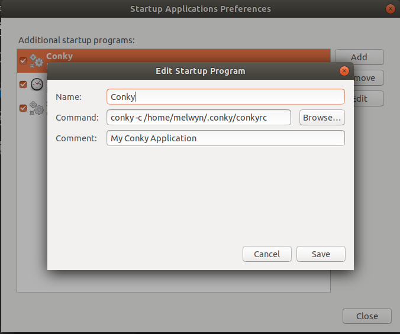
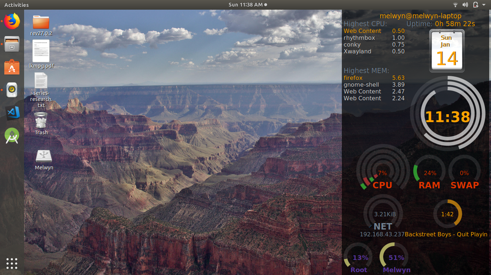

# ConkyMonitor
This is my conky implementation

**Note: Requires latest conky to be installed in the system**

# Installation
1. Create **.conky** folder in your home directory.
1. Copy all the files in that directory.
1. If you are using Ubuntu then all following entry in startup application.
    1. Name: Conky
    1. Command: conky -c ~/.conky/conkyrc

Fig 1. Adding conky to Startup screen

Fig 2. My Desktop Screenshot